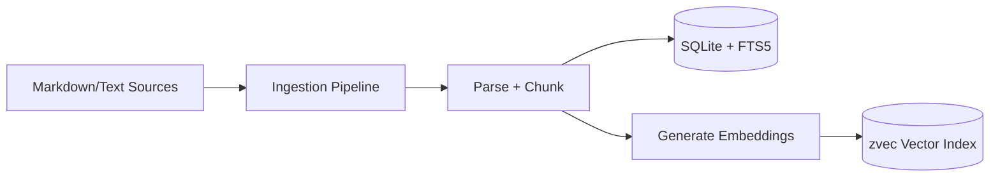
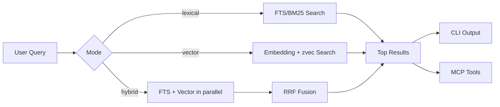

# zmem

Local-first hybrid memory for engineering workflows.

`zmem` is a small POC/experiment inspired by QMD-style document search, built to explore whether we can get strong practical recall by combining:

- dense retrieval via `@zvec/zvec`
- lexical retrieval via SQLite FTS5/BM25
- a simple fusion pipeline (RRF)
- a local MCP server for coding-agent integration
- graph data for relationships between memories (wip)

overall it is a local-first, agent-oriented memory substrate for engineering decisions and evolving project context

Install from npm (global CLI):

```bash
npm install -g @cosmiclasagnadev/zmem
zmem help
```

References:
- [QMD](https://github.com/tobi/qmd)
- [ZVec](https://github.com/alibaba/zvec)

## What this does differently
- explicit memory types and lifecycle (pending, active, archived, deleted) plus supersedes_id
  - if no explicit type is defined, it defaults to 'fact'
  - if no explicit tags are defined, it defaults to '[]' 
- **no concrete query expansion step yet** since graph traversal is part of pipeline and I'm not sure how to effectively do query expansion once graph comes in to play
- uses `@zvec/zvec` for dense retrieval when doing vector search

## Architecture (high level)

- **Language/runtime:** TypeScript + Node.js
- **Vectors:** `@zvec/zvec`
- **Lexical:** `better-sqlite3` + FTS5/BM25
- **Embeddings:** `node-llama-cpp` (default model: Qwen3-Embedding-0.6B GGUF)
- **Validation:** `zod`
- **Agent integration:** `@modelcontextprotocol/sdk`

Hybrid retrieval flow (follows qmd's style closely):

1. lexical search (FTS/BM25)
2. vector search (zvec)
3. reciprocal rank fusion (RRF)
4. optional rerank hooks (future-facing)

### Indexing pipeline



### Retrieval pipeline



At runtime, the same core API powers both CLI commands and MCP tools, so behavior stays consistent across direct terminal use and agent workflows.

## Project layout

- `src/ingest/` - discovery, parsing, chunking, orchestration
- `src/search/` - lexical/vector retrieval + fusion
- `src/core/` - shared API (`save`, `recall`, `get`, `list`, `delete`, `reindex`, `status`)
- `src/mcp/` - MCP server + tool registration
- `src/db/` - SQLite handling + migrations
- `config.example.json` - sample configuration

## Getting started

### 1) Install

```bash
npm install
```

### 2) Configure

Create your local config file:

```bash
cp config.example.json config.json
```

Then update:

- `workspaces[].root` to a real absolute path
- any desired `patterns` for ingestion
- storage paths (`storage.dbPath`, `storage.zvecPath`) if needed

If `config.json` is missing, `zmem` falls back to defaults.

### 3) Ingest documents

```bash
npm run dev -- ingest ./docs --workspace=default
```

### 4) Query memory

```bash
npm run dev -- query "database decisions" --mode=hybrid --workspace=default
```

### 5) Check status

```bash
npm run dev -- status --workspace=default
```

## CLI usage

Run help:

```bash
npm run dev -- help
```

Primary commands:

- `ingest <path> [--workspace=<name>] [--logs=true|false]`
- `query <query> [--workspace=<name>] [--mode=hybrid|lexical|vector] [--scopes=a,b] [--types=a,b] [--logs=true|false]`
- `status [--workspace=<name>] [--logs=true|false]`
- `mcp [--config=./config.json] [--workspace=<name>] [--verbose=true|false]`

Examples:

```bash
npm run dev -- ingest ./test-docs/search --workspace=default
npm run dev -- query "sqlite" --mode=lexical --workspace=default
npm run dev -- query "vector embeddings" --mode=vector --workspace=default
```

## MCP usage

Start the MCP stdio server:

```bash
npm run dev -- mcp --workspace=default
```

Implemented tools:

- `memory_query`
- `memory_get`
- `memory_list`
- `memory_save`
- `memory_delete`
- `memory_status`

Optional admin tool:

- `memory_reindex` (enabled with `ZMEM_ENABLE_REINDEX_TOOL=true`)

Verbose MCP logs:

```bash
ZMEM_MCP_VERBOSE=true npm run dev -- mcp --workspace=default
```

## Local development

Useful scripts:

- `npm run dev` - run CLI via `tsx`
- `npm run build` - build TypeScript to `dist/`
- `npm start` - run built CLI
- `npm run typecheck` - type-check without emitting
- `npm test` - run tests
- `npm run smoke` - build + smoke script

Typical dev loop:

```bash
npm run typecheck
npm test
npm run smoke
```

## Environment variables

- `ZMD_EMBED_MODEL` - override embedding model
- `ZMD_EMBED_PROVIDER` - override embedding provider (`llamacpp`, `openai`, `ollama`)
- `ZMEM_WORKSPACE` - default workspace for MCP resolution
- `ZMEM_MCP_VERBOSE=true` - verbose MCP logs to stderr
- `ZMEM_ENABLE_REINDEX_TOOL=true` - expose `memory_reindex` MCP tool

## Roadmap
- [ ] graph traversal poc 
- [ ] Rust implementation and comparison with metrics
- [ ] policy/compliance/audit/retention layer
- [ ] added unit tests for error paths 
- [ ] improve batching controls and recall latency metrics
- [ ] more integration ergonomics and ideas
- [ ] reranking improvements (position-aware blend)
- [ ] query expansion strategies
- [ ] deeper retrieval tuning and eval harnesses
